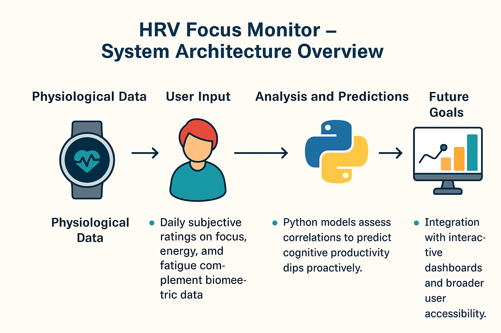

# HRV Focus Monitor

**HRV Focus Monitor** is a personal research project that uses biometric and behavioral data to predict mental fatigue. The system analyzes heart rate variability (HRV) and self-reported cognitive data to provide early warnings of performance drops — especially for knowledge workers and developers.

It is designed to integrate with the **Garmin Health API**, making use of JSON-formatted, high-resolution metrics such as enhanced beat-to-beat intervals (RR data), stress, sleep, and heart rate.  

---

## 🔧 How It Works

1. **Garmin Health Data** — Collected via wearable (e.g., Forerunner 965)
   - Heart Rate (HR)
   - Enhanced Beat-to-Beat Intervals (RR)
   - Sleep stages
   - Stress and Recovery

2. **Self-Reported Data** — Collected via local surveys or browser forms
   - Focus, energy, sleep quality, perceived fatigue

3. **Python Model** — Local ML logic fuses biometric + subjective data  
   - Detects signs of mental overload
   - Predicts dips in cognitive performance before they’re felt

4. **Output** — (In development)
   - Real-time dashboards (future Streamlit implementation)
   - Alert system to suggest breaks or adjustments

---

## ⚙️ Features

- REST-based integration via Garmin Health API
- JSON-format data flow for scalable analysis
- Local-first storage with zero data sharing
- Adaptable logic for personalization
- Designed with GDPR-aware principles

---

## 📦 Project Status

- **Early-stage** / Single-user
- Non-commercial
- All processing and storage handled locally
- Actively evolving — see [TODO](#) for planned improvements

---

## 🔐 Privacy & Data Use

All data is collected with full consent and stored securely for personal research use only.  
No cloud sync, no third-party sharing.  
See full [Privacy Policy](https://willelangberg.github.io/hrv_focus/) →

---

## 🖼️ Preview

  
(*Example: Garmin HRV + Fatigue → Python model → early warnings*)

---

## 📬 Contact

Email: wille.langberg9@gmail.com  
GitHub: [@willelangberg](https://github.com/willelangberg)

---

© 2025 HRV Focus Monitor – All rights reserved.
